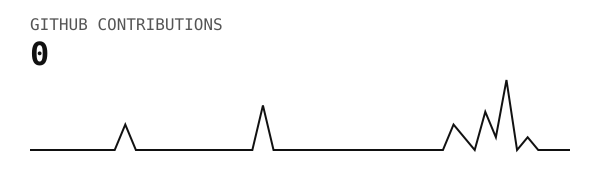
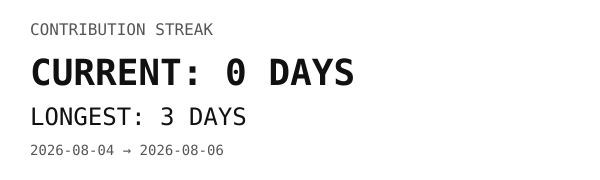
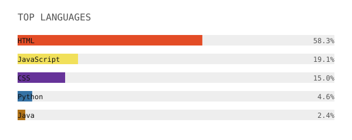
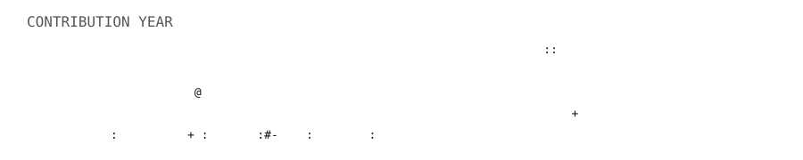

# SONU2622007-SYS

### B.Tech Information Technology Student

---

## About Me

I'm a B.Tech Information Technology student interested in software development, data analytics, and modern web technologies.

I enjoy building projects, learning new technologies, and experimenting with APIs and automation.

---

## My GitHub Activity

 

 

 

 

---

## Technologies

`Python` `Java` `JavaScript` `HTML` `CSS` `SQL` `Git` `GitHub`

---

## Projects

- Ocean Hazard Reporting Platform
- URL Shortener with Click Analytics
- Employee Management System
- Student Feedback Management System
- Stock Trading Platform

---

Generated automatically from my own repository.

